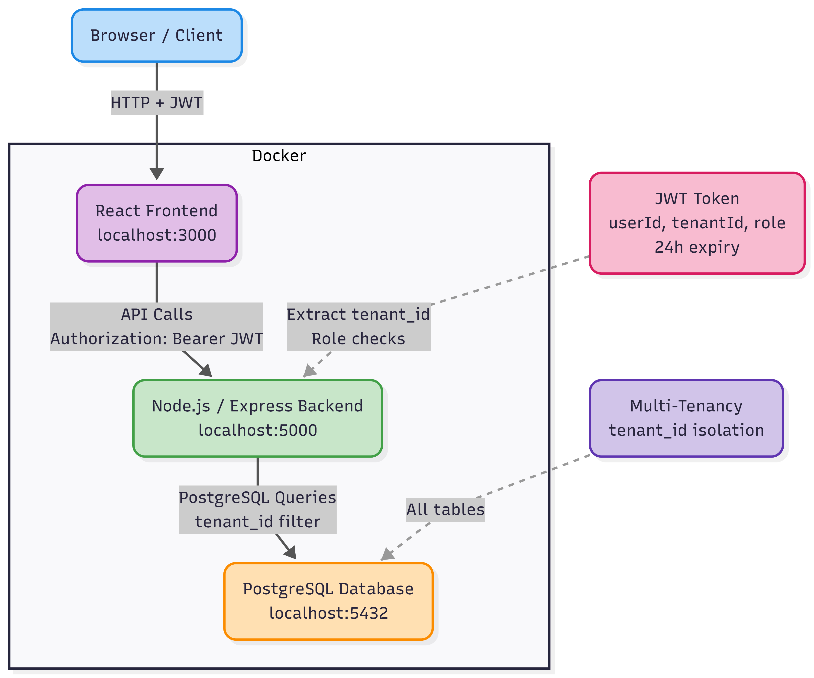

# Multi-Tenant SaaS Platform – Project & Task Management System

## Project Description

This project is a **production-ready Multi-Tenant SaaS application** that allows multiple organizations (tenants) to independently manage their users, projects, and tasks with complete data isolation.  
It is designed for **startups, enterprises, and SaaS product teams** that require secure multi-tenant architecture with role-based access control and subscription management.

---

## Key Features

- Multi-tenant architecture with strict data isolation
- Subdomain-based tenant identification
- JWT-based authentication with 24-hour expiry
- Role-Based Access Control (Super Admin, Tenant Admin, User)
- Tenant subscription plans with enforced limits
- Project and task management per tenant
- User management within tenants
- Audit logging for critical actions
- Secure password hashing using bcrypt
- Fully dockerized deployment with one-command startup
- Automatic database migrations and seed data
- Health check endpoint for system monitoring
- Responsive frontend with role-based UI rendering

---

## Demo Video : 

    https://drive.google.com/file/d/1k1GVZgcB4lPsFIcSv3UWt8duZsAN7P0A/view?usp=sharing

## Technology Stack

### Frontend
- React.js (v18)
- React Router DOM
- Axios
- Context API
- CSS (Custom styling)

### Backend
- Node.js (v18)
- Express.js
- JWT (jsonwebtoken)
- bcrypt
- Knex.js (Query Builder)

### Database
- PostgreSQL (v15)

### DevOps & Containerization
- Docker
- Docker Compose

---

## Architecture Overview

The system follows a **three-tier architecture**:

1. **Frontend (React)**  
   Handles user interface, authentication flow, and API interactions.

2. **Backend (Express API)**  
   Manages business logic, authentication, authorization, tenant isolation, and database access.

3. **Database (PostgreSQL)**  
   Stores tenant, user, project, task, and audit log data with strict foreign key constraints.

### Architecture Diagram

---

## Installation & Setup

### Prerequisites

Ensure the following are installed:

- Node.js (v18 or higher)
- npm
- Docker
- Docker Compose
- Git

---

### Local Setup (Docker – Recommended)

This project is **fully containerized** and requires only **one command** to start.

docker-compose up -d

## Automatic Startup Behavior

When running the application using Docker Compose, the following steps occur automatically:

- Start PostgreSQL database
- Run database migrations
- Load seed data
- Start backend API server
- Start frontend application

---

## Service Ports

| Service   | Port |
|----------|------|
| Frontend | 3000 |
| Backend  | 5000 |
| Database | 5432 |

---

## Health Check

Verify backend readiness using the health check endpoint:

curl http://localhost:5000/api/health
